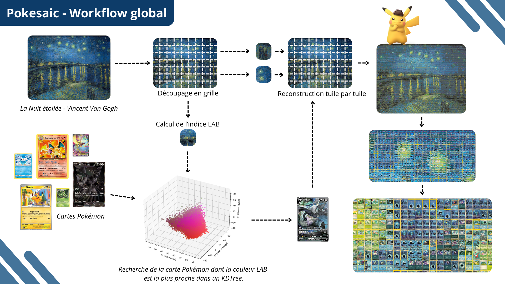

<p align="center">
  
</p>

<h1 align="center">Pokesaic</h1>

<p align="center">
  <strong>Recreate famous artworks as mosaics made entirely of Pokémon TCG cards.</strong>
</p>

<p align="center">
  
  
  
</p>

---

## Table of Contents

- [About](#about)
- [How It Works](#how-it-works)
- [Project Structure](#project-structure)
- [Installation](#installation)
- [Usage](#usage)
- [Performance](#performance)
- [Tech Stack](#tech-stack)
- [Credits](#credits)
- [License](#license)

---

## About

**Pokesaic** transforms any image into a mosaic composed entirely of Pokémon Trading Card Game cards. Each tile of the mosaic is replaced by the Pokémon card whose dominant color best matches the original region, using perceptually accurate color matching in the **CIELAB color space** and a **KD-Tree** for fast nearest-neighbor search.

The concept was originally inspired by a video from [Newbie Indie Game Dev](https://lnkd.in/ekDVzwMr) on YouTube. The main goal of this project was to reproduce the idea from scratch and **drastically improve generation speed** — from **~2 hours** in the original video down to **~4 minutes** on my side.

---

## How It Works

The pipeline follows four main stages:

### 1. Data Preparation

All Pokémon TCG card images are downloaded, and for each card a **dominant color** is computed in the CIELAB color space. A 10% margin is cropped from each card before computing the mean color to avoid border artifacts.

### 2. KD-Tree Indexing

A **scipy KD-Tree** is built from the LAB color vectors of all cards (~10,000+). This spatial index enables O(log N) nearest-neighbor lookups instead of brute-force comparisons.

### 3. Grid Decomposition & Matching

The input image is divided into a grid of tiles (177×250 px each — standard Pokémon card ratio). For each tile:
- The average LAB color is computed
- The KD-Tree is queried to find the closest matching Pokémon card

### 4. Mosaic Assembly

Each matched card is placed at its corresponding grid position to reconstruct the final mosaic image.

> **Why CIELAB?** Unlike RGB, the CIELAB color space is perceptually uniform — Euclidean distances between LAB vectors closely approximate how humans perceive color differences. This produces significantly more visually accurate mosaics.

---

## Project Structure

```
Pokesaic/
├── src/
│   ├── KDTree_generator.py         # KD-Tree construction & serialization
│   ├── pokesaic_generator.py       # Mosaic generation engine
│   └── models/
│       ├── pokemon_card.py          # Card model (download, LAB color extraction)
│       └── pokemon_series.py        # Series grouping model
├── scripts/
│   ├── cache_colors.py              # Step 1: Enrich card data with LAB colors
│   ├── generate_KDTree.py           # Step 2: Build & save the KD-Tree index
│   └── generate_pokesaic.py         # Step 3: Generate a mosaic from an image
├── data/
│   ├── json/
│   │   ├── pokemon_cards.json       # Raw card metadata
│   │   └── pokemon_cards_labs.json  # Card metadata + LAB colors
│   ├── kdtree/
│   │   └── pokemon_kdtree.pkl       # Serialized KD-Tree index
│   ├── images/                      # Cached card images
│   ├── input/                       # Source images (e.g. La Joconde)
│   └── output/                      # Generated mosaics
├── worflow.png                      # Visual workflow diagram
├── LICENSE
└── README.md
```

---

## Installation

### Prerequisites

- Python 3.10+

### Setup

```bash
# Clone the repository
git clone https://github.com/lucienlaumont/Pokesaic.git
cd Pokesaic

# Create a virtual environment
python -m venv .venv
source .venv/bin/activate  # Linux/macOS
# .venv\Scripts\activate   # Windows

# Install dependencies
pip install numpy scipy scikit-image Pillow requests tqdm
```

---

## Usage

The project runs in three sequential steps:

### Step 1 — Cache card colors

Downloads all Pokémon card images and computes their dominant LAB color.

```bash
python scripts/cache_colors.py
```

> This step produces `data/json/pokemon_cards_labs.json` and caches images in `data/images/`.

### Step 2 — Build the KD-Tree

Constructs the spatial index from the enriched card data.

```bash
python scripts/generate_KDTree.py
```

> This step produces `data/kdtree/pokemon_kdtree.pkl`.

### Step 3 — Generate a mosaic

Place your source image in `data/input/`, then run:

```bash
python scripts/generate_pokesaic.py
```

You can adjust the **scale** parameter in the script to control mosaic resolution:

| Scale | Grid density | Detail level |
|-------|-------------|--------------|
| 1     | Low         | Abstract / artistic |
| 10    | Medium      | Recognizable |
| 20    | High        | Detailed reproduction |

> Higher scale values produce finer mosaics with more cards but take longer to generate.

---

## Performance

| Metric | Value |
|--------|-------|
| **Generation time** | ~4 minutes (scale=20) |
| **Original benchmark** | ~2 hours ([source video](https://lnkd.in/ekDVzwMr)) |
| **Speedup** | ~30× faster |

Key optimizations:
- **Vectorized LAB conversion** — NumPy batch operations instead of per-pixel loops
- **Batched KD-Tree queries** — all tiles queried in a single call
- **Multi-threaded tile processing** — `ThreadPoolExecutor` for parallel I/O
- **Image caching** — card images loaded once and reused

---

## Tech Stack

| Library | Role |
|---------|------|
| **NumPy** | Vectorized array operations |
| **SciPy** | KD-Tree spatial indexing |
| **scikit-image** | RGB → CIELAB color conversion |
| **Pillow** | Image loading, resizing & assembly |
| **requests** | Card image downloading |
| **tqdm** | Progress bars |

---

## Credits

- **Inspiration**: [Newbie Indie Game Dev](https://lnkd.in/ekDVzwMr) — original concept video on YouTube
- **Card data**: Images sourced from the Pokémon TCG database via [Pokécardex](https://www.pokecardex.com/)

---

## License

This project is licensed under the **MIT License** — see the [LICENSE](LICENSE) file for details.
